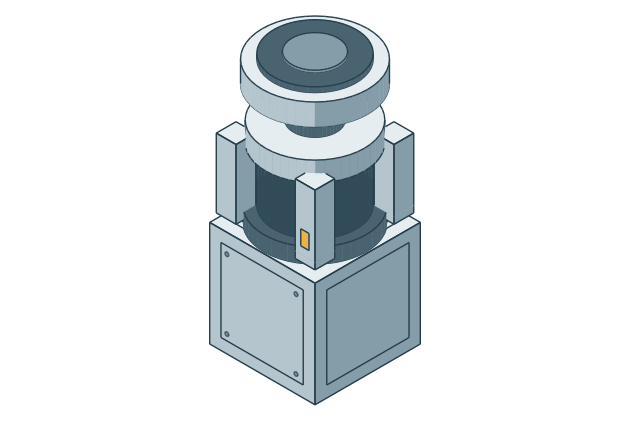
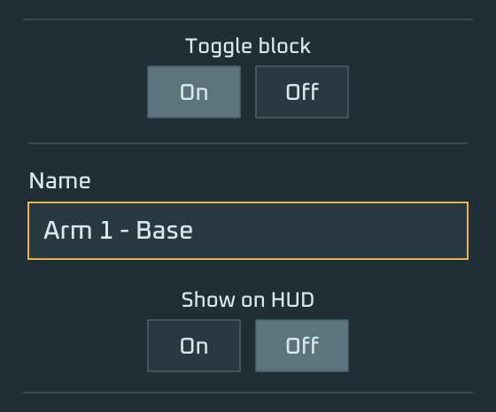
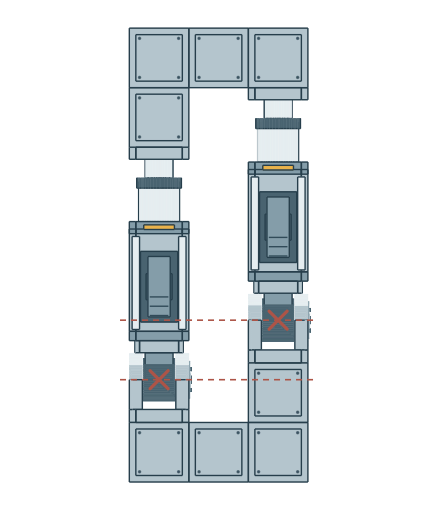
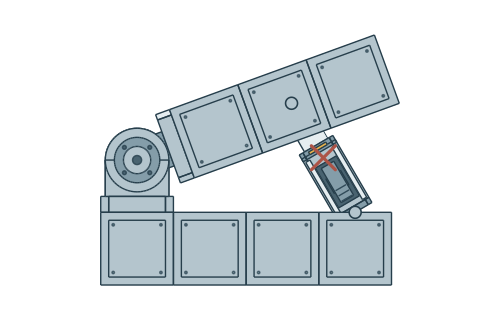
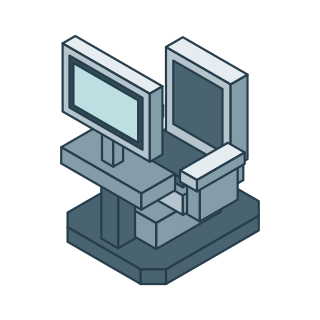
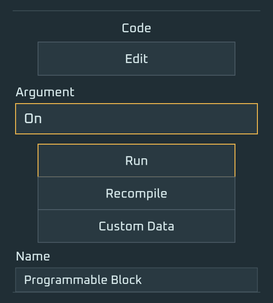

# Getting Started with AutoArm

Build your arm, name its base and head, then let AutoArm discover the joints between them. Start with a powered grid in a world with in-game scripts enabled.

The [illustrated HTML guide](getting-started.html) includes the same nine steps with a layout for reading and printing. The [guide bundle](assets/exports/autoarm-getting-started.zip) includes the page, SVG artwork and fonts.

## 1. Place your first actuator

Place a rotor on your grid. This first actuator will be the base of your arm. A hinge or piston can also be the first actuator; this guide uses a rotor.

## 2. Name the base

Open the rotor in the terminal and name it **`<MyArmName> - Base`**. Replace `<MyArmName>` with your arm's name; for example, **`Arm 1 - Base`**. Name the rotor base rather than its moving rotor head.

## 3. Build the rest of the arm on top

Build from the base rotor toward the tool. Intermediate rotors, hinges and pistons can keep their ordinary names.

The example, from bottom to top, is:

1. Base rotor.
2. A crossbar.
3. Two hinges, one on each end of the crossbar, with a shared rotation axis.
4. Two pistons, one above each hinge.
5. A second crossbar, joining the piston heads.
6. A single hinge in the middle of the upper crossbar.
7. Rotor → hinge → piston → rotor → hinge → hinge → rotor → drill head.

### What not to do

Parallel hinges and pistons are supported when their stages line up.

**Parallel stages that don't line up:** Parallel placement is supported, but offset hinge and piston stages are not supported.

**Hydraulic structures:** A piston used as a brace to drive a hinged linkage is not supported.

## 4. Name the head

Name the tool or final terminal block at the moving end **`<MyArmName> - Head`**. Use the same prefix as the base: **`Arm 1 - Head`** in this example. Use exactly one head marker; here, rename the drill itself.

## 5. Place a cockpit or controller

Place a cockpit, control seat or another ship controller on the same construct. Sit in it, or take control of it, when you are ready to send movement inputs.

## 6. Place a programmable block

Place a programmable block on the same construct as the arm. This block will run AutoArm. The example keeps it beside the arm on a connected foundation grid.

## 7. Load the script and run `On`

1. Open the programmable block's **Edit** window.
2. Paste the entire [AutoArm script](../stable/AutoArm_Compact.txt) and save it.
3. Enter **`On`** in **Argument**, then press **Run**.

For a fresh programmable block, AutoArm discovers arm names from the base markers and generates its configuration.

## 8. Take control of your arm

Sit in your cockpit or take control of your ship controller. Use **WASD** and **C / Space** to move the arm. By default, movement follows the head's orientation.

| Key | Movement |
| --- | --- |
| W / S | Forward / backward |
| A / D | Left / right |
| Space / C | Up / down |

## 9. Go further with AutoArm

See the [README](../README.md) for additional scripts and tools, [configuration examples](examples) for Custom Data settings, and [Troubleshooting](TROUBLESHOOTING.md) for common problems.
